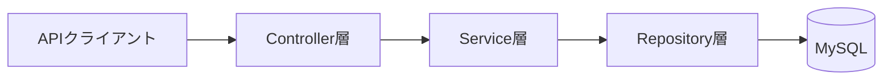
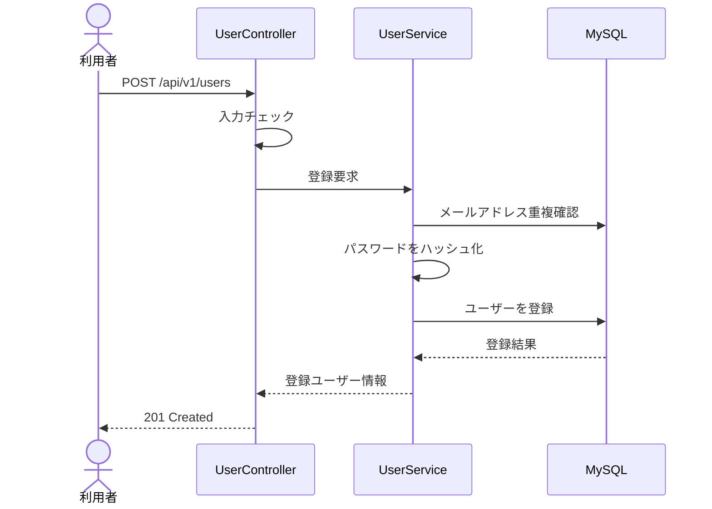

# ユーザー管理・認証システム 基本設計書

| 項目 | 内容 |
|---|---|
| 文書名 | ユーザー管理・認証システム 基本設計書 |
| バージョン | 0.1 |
| 作成日 | 2026-08-02 |
| 状態 | 学習用初版 |

## 1. システム概要

本システムは、ユーザー登録、ログイン、ユーザー情報参照、パスワード変更および権限管理を提供するREST APIである。

本プロジェクトの目的は、単に動作するAPIを作成することではない。Spring Bootを利用した業務システム開発に必要となる基本設計、入力チェック、データベース制約、トランザクション、例外処理、セキュリティ、ログおよびテストを段階的に学習することである。

## 2. 目的

1. JavaおよびSpring Bootの技術力を実装を通して回復する。
2. 日本の開発現場で使用される設計用語と説明表現を身につける。
3. 面接で設計理由、実装方法、リスクおよびテスト観点を説明できるようにする。
4. GitHubとブログに掲載できる成果物を作成する。

## 3. 対象範囲

### 3.1 対象機能

| 機能ID | 機能名 | 概要 | 実装予定STEP |
|---|---|---|---:|
| USR-001 | ユーザー登録 | メールアドレスとパスワードを受け取り、ユーザーを登録する | 03〜08 |
| AUT-001 | ログイン | 認証情報を検証し、アクセストークンを発行する | 09 |
| USR-002 | ユーザー情報参照 | 認証済みユーザーが自分の情報を参照する | 09 |
| USR-003 | パスワード変更 | 現在のパスワードを確認して新しいパスワードへ変更する | 09以降 |
| AUT-002 | ログアウト | トークンまたはセッションを無効化する | 09以降 |
| ADM-001 | ユーザー一覧 | 管理者がユーザー一覧を参照する | 将来 |

### 3.2 今回の対象外

- ReactまたはVueによるフロントエンド
- SNSログイン
- メールによる本人確認
- パスワード再設定メール
- マイクロサービス化
- Kubernetesへのデプロイ

これらはバックエンドの基本機能とテストを理解した後で追加する。

## 4. システム構成

初期段階では、学習とデバッグを容易にするため、レイヤードアーキテクチャを採用した単一のSpring Bootアプリケーションとする。



### 4.1 レイヤーの責務

| レイヤー | 主な責務 |
|---|---|
| Controller | HTTPリクエストの受付、入力形式の確認、レスポンスの返却 |
| Service | 業務ルール、トランザクション境界、処理の組み立て |
| Repository | データベースへの保存と検索 |
| Domain | ユーザーなどの業務データとルールの表現 |
| Exception Handler | 例外から共通エラーレスポンスへの変換 |

## 5. API一覧

APIの詳細は各STEPで確定する。現時点の基本方針は次のとおりである。

| API ID | メソッド | パス | 認証 | 正常時ステータス |
|---|---|---|---|---:|
| USR-001 | POST | `/api/v1/users` | 不要 | 201 |
| AUT-001 | POST | `/api/v1/auth/login` | 不要 | 200 |
| USR-002 | GET | `/api/v1/users/me` | 必要 | 200 |
| USR-003 | PUT | `/api/v1/users/me/password` | 必要 | 204 |
| AUT-002 | POST | `/api/v1/auth/logout` | 必要 | 204 |

## 6. ユーザー登録の基本フロー



事前の重複確認だけでは同時登録を完全に防止できない。そのため、アプリケーション側の確認に加えて、データベースにもメールアドレスの一意制約を設定する。

## 7. データ設計（初版）

### 7.1 usersテーブル

| カラム | 型（予定） | NULL | 制約 | 説明 |
|---|---|---|---|---|
| id | BIGINT | 不可 | PK | ユーザーID |
| email | VARCHAR(254) | 不可 | UNIQUE | 正規化したメールアドレス |
| password_hash | VARCHAR(255) | 不可 |  | ハッシュ化したパスワード |
| display_name | VARCHAR(100) | 不可 |  | 表示名 |
| role | VARCHAR(30) | 不可 |  | 権限 |
| status | VARCHAR(30) | 不可 |  | ユーザー状態 |
| created_at | DATETIME | 不可 |  | 作成日時 |
| updated_at | DATETIME | 不可 |  | 更新日時 |
| version | BIGINT | 不可 |  | 楽観ロック用バージョン |

パスワードの平文は保存しない。ログ、例外メッセージおよびAPIレスポンスにもパスワードを出力しない。

## 8. 入力チェック方針

| 項目 | 主なチェック |
|---|---|
| email | 必須、メール形式、最大254文字、前後空白の除去、小文字への正規化 |
| password | 必須、長さ、使用可能文字、メールアドレスとの一致禁止 |
| displayName | 必須、最大100文字、空白文字だけの入力禁止 |

入力形式の検証にはJakarta Bean Validationを使用する。業務上の重複チェックや状態チェックはService層で行う。

## 9. エラー処理方針

`@ControllerAdvice`と`@ExceptionHandler`を利用し、エラーレスポンスの形式を統一する。

```json
{
  "code": "USER_EMAIL_ALREADY_EXISTS",
  "message": "指定されたメールアドレスは既に登録されています。",
  "details": [],
  "timestamp": "2026-08-02T10:00:00+09:00"
}
```

内部例外の詳細やSQL、パスワードなどの機密情報はレスポンスに含めない。

## 10. トランザクション方針

- ユーザー登録処理のトランザクション境界はService層に設定する。
- データベース更新に失敗した場合は登録処理全体をロールバックする。
- 外部APIや時間のかかる処理を、必要なくトランザクション内に含めない。
- `@Transactional`の自己呼び出し、例外の握りつぶし、可視性に注意する。

## 11. セキュリティ方針

- パスワードは安全な一方向ハッシュで保存する。
- パスワード、トークン、認証ヘッダーをログへ出力しない。
- 認証エラーでは、メールアドレスが登録済みかどうかを必要以上に公開しない。
- 権限確認はサーバー側で行い、クライアントから送信された権限を信用しない。

## 12. ログ方針

記録する情報：

- リクエストを追跡するための識別子
- 処理結果
- 処理時間
- エラーコード
- 調査に必要なユーザーID（必要な場合のみ）

記録しない情報：

- パスワード
- アクセストークン
- Authorizationヘッダー
- 個人情報を含むリクエストボディ全体

## 13. テスト方針

| 種別 | 確認内容 |
|---|---|
| 単体テスト | Serviceの業務ルールと例外条件 |
| Controllerテスト | 入力チェック、HTTPステータス、JSON形式 |
| Repositoryテスト | 一意制約、検索、永続化 |
| 結合テスト | APIからデータベースまでの正常系と異常系 |
| 同時実行テスト | 同一メールアドレスの同時登録 |
| セキュリティテスト | 未認証アクセス、権限不足、機密情報の非出力 |

## 14. 非機能要件（学習用目標）

- 通常の登録APIはローカル環境で500ミリ秒以内を目標とする。
- エラー時も共通形式のJSONを返す。
- ヘルスチェック用のエンドポイントを提供する。
- 設定値は環境変数または外部設定で切り替えられるようにする。
- READMEの手順だけで第三者が起動できる状態を維持する。

## 15. 面接復習テーマと実装計画

この章はプロジェクト全体のロードマップを示す。各学習ガイドには、そのSTEPで実装・検証した内容だけを記載する。

| STEP | 面接復習テーマ | 実装内容 |
|---:|---|---|
| 01 | Spring Bootの起動原理 | プロジェクト構築、Actuator |
| 02 | JPAとMyBatisの違い、EntityとRepository | MySQL接続、JPAデータアクセス基盤 |
| 03 | パスワードを安全に保存する方法 | PasswordEncoder、ハッシュ化、照合方法 |
| 04 | Spring Bootでユーザー登録APIを設計する | DTO、Service、Controller、安全なパスワード保存 |
| 05 | メールアドレスの重複登録を防ぐ方法 | 事前確認、一意制約、競合時の処理 |
| 06 | Springの`@Transactional`が効かないケース | トランザクションとロールバック検証 |
| 07 | `@ControllerAdvice`による例外処理 | 業務例外、共通エラーレスポンス |
| 08 | ユーザー登録APIのテスト設計 | 単体、Controller、Repository、結合テスト |
| 09 | JWT認証の仕組みと注意点 | ログイン、アクセストークン、認可 |
| 10 | ログに機密情報を出力しないための設計 | ログ設計、マスキング、トレースID |
| 11 | Reactによるフロントエンド | バックエンドAPIとの連携 |
| 12 | Vueによるフロントエンド | バックエンドAPIとの連携 |

各STEPでは、実装とテストを完了した後に面接回答を作成する。「コードを読める」「中国語で説明できる」「日本語で説明できる」の三段階を確認してから次へ進む。
